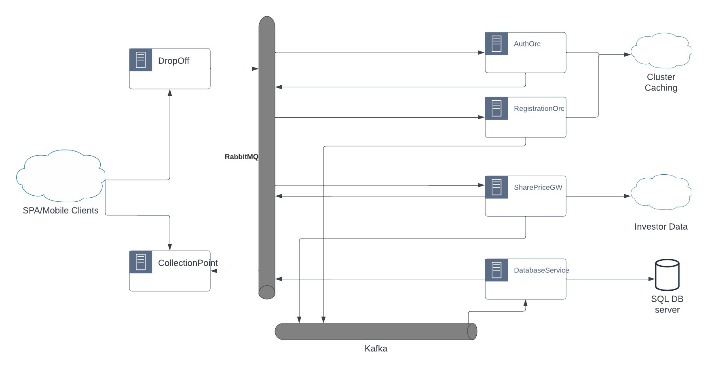

# shareprice-config

This is a shared configuration library for the *share price* applications.

## Introduction
See image below to see the various services.

As can be seen, this system uses:
1. RabbitMQ to pass SIMEX messages. Most of these messages will be for fetching data from one system to another.
2. Kafka topics. Most of these will be requests that makes changes in the data, such as updates to database
3. Caching Cluster - using Hazelcast, to access data that is read often and changes very little.

## How Authentication Works
Authentication in Shareprice system uses JWT tokens with rotating refresh tokens. The Authorisation tokens have a 5 minute
lifespan whereas the refresh token has 30 minute lifespan.

The service **service.auth** handles customer authentication and supports three SIMEX messages:
1. A request to *user* entity - which should result in authorisation token and refresh token response
2. A request to *token* entity - which results in a new authorisation token and refresh token (refresh tokens are rotated)
3. A response from **service.dbread** with the user principal

1. The client submits username/password to *service.auth* via *drop-off* service
2. The *service.auth*:
   1. Sends the message to *service.dbread* for user information
   2. Stores the message in *request.authentication* cache
3. The *service.dbread* reads from the user table and sends a response back to *service.auth*
4. On receiving the response, *service.auth* fetches the original message from *request.authenticaition* and compares the password hash
5. If authentication succeeds:
   1. generates authorisation and refresh tokens and saves the user principal in the cache, by the tokens
   2. Sends a response to *service.collectionPoint*
6. If authentication fails, it sends an empty response to *service.collectionPoint*
7. If a request is for *token* entity, it will check in cache and regenerate both tokens and send this as a response.

## Dependencies
In order to define RabbitMQ queues and Kafka topics, along with their configurations, this library pulls in
`simex-rabbitmq`, `simex-kafka` and `simex-caching` libraries.

## Endpoint definitions: `shareprice.config.ServiceDefinition`
Endpoints are defined in the class `ServiceDefinition` as follows:

* `DropOffService` = **service.drop-off** 
* `AuthenticationService` = **service.auth**
* `DatabaseROService` = **service.dbread**
* `DatabaseUpdateService` = **service.dbwrite**
* `CollectionPointService` = **service.collectionPoint**

## RabbitMQ Queues: `shareprice.rabbitmq.SharepriceQueue`
1. **SERVICE_AUTHENTICATION_QUEUE** - For all authentication requests
2. **SERVICE_DBREAD_QUEUE** - for all database reads
3. **SERVICE_COLLECTION_POINT_QUEUE** - for all responses to send to front-end systems

The queue for **service.drop-off** is not defined as no messges are ever sent to this service from other backend services.

## Caching Maps: `shareprice.caching.CachingMap`
1. **request.authentication** - used to store the original authentication request, by username
2. **authentication.auth-token** - used to store user principal by the authorization JWT token
3. **authentication.refresh-token** - used to store user principal by the refresh JWT token

## Kafka Topic: `shareprice.kafka.SharepriceTopic`
* **dbwrite** - requests for database updates/inserts/deletes

## Diagram

